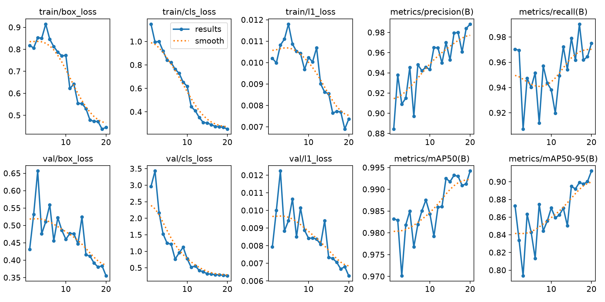

# YOLO 手势控制自动化系统

一个使用笔记本摄像头和自训练 YOLO 模型完成的实时自动化控制项目。系统识别右手手势，将视觉指令转换为设备状态，并用连续多帧确认和冷却时间降低误触发。

## 项目效果

| 手势 | 控制状态 |
| --- | --- |
| 张开手掌 `palm` | `RUNNING` |
| 握拳 `fist` | `STOPPED` |
| 点赞 `thumb_up` | `READY` |

第二轮模型使用 774 张自行采集的摄像头图像完成自动标注与训练，其中 11 张未检测到手的样本被自动排除。

| 指标 | 验证结果 |
| --- | ---: |
| Precision | 98.83% |
| Recall | 97.51% |
| mAP50 | 99.42% |
| mAP50-95 | 91.22% |



## 方案对比：Teachable Machine 与 YOLO

项目初期先使用 Teachable Machine 进行了网页端图像分类实验，随后根据摄像头实测结果改用 YOLO，并加入 MediaPipe 左右手判断。

| 对比项 | Teachable Machine | YOLO + MediaPipe |
| --- | --- | --- |
| 识别方式 | 判断整张画面属于哪个类别 | 定位手部方框并识别手势 |
| 训练难度 | 无代码、上手快 | 需要标注、数据划分和本地训练 |
| 复杂背景 | 容易把背景特征当成判断依据 | 更关注手部目标，抗背景干扰更好 |
| Other 类别 | 样本范围过大时容易长期占据高概率 | 使用背景空标注，不作为手势类别输出 |
| 左右手限制 | 不能直接满足 | MediaPipe 判断左右手，默认仅右手有效 |
| 自动化可靠性 | 适合快速验证想法 | 连续多帧确认和冷却机制更适合实时控制 |

Teachable Machine 帮助快速验证了三种手势可以被区分，但实测中 Other 概率容易偏高，且整图分类无法给出手的位置。最终方案选择 YOLO 负责手势检测、MediaPipe 负责左右手过滤，再通过状态机输出自动化指令。

## 系统流程

`摄像头画面 → YOLO 手势检测 → MediaPipe 左右手判断 → 连续 8 帧稳定确认 → 自动化状态切换`

主要设计：

- YOLO 检测手势类别及位置；
- MediaPipe 判断左右手，默认只有右手指令有效；
- 只采用置信度最高的检测结果；
- 连续 8 帧识别一致后才执行指令；
- 1.2 秒冷却时间防止重复触发；
- 自动使用 NVIDIA GPU，未检测到 CUDA 时回退到 CPU；
- 不保存运行时摄像头画面。

## 快速运行

环境建议：Windows 11、Python 3.12、带摄像头的电脑。

```powershell
py -3.12 -m venv .venv
.\.venv\Scripts\python.exe -m pip install -r requirements.txt
.\.venv\Scripts\python.exe app.py
```

运行时按键：

- `Q` 或 `Esc`：退出；
- `H`：切换允许控制的左手/右手。

仓库已经包含正式手势模型 `models/gesture_best.pt` 和 MediaPipe 手部定位模型，因此无需重新训练即可演示。

## 自己采集并重新训练

```powershell
.\.venv\Scripts\python.exe capture.py
.\.venv\Scripts\python.exe auto_label.py
.\.venv\Scripts\python.exe prepare_dataset.py
.\.venv\Scripts\yolo.exe detect train data=dataset/data.yaml model=yolo26n.pt epochs=30 imgsz=640 batch=16 device=0 workers=0 cache=True
```

采集器按键：`1` 张开手掌、`2` 握拳、`3` 点赞、`4` 背景、`S` 保存、`Q` 退出。`auto_label.py` 使用 MediaPipe 自动生成 YOLO 方框，减少手工标注工作。

## 文件说明

- `app.py`：实时识别与自动化状态控制；
- `capture.py`：摄像头数据采集；
- `auto_label.py`：自动生成 YOLO 标签；
- `prepare_dataset.py`：清理画面、分层划分训练集和验证集；
- `models/gesture_best.pt`：最终训练模型；
- `models/hand_landmarker.task`：左右手识别模型。

## 隐私说明

公开仓库不包含原始照片、训练/验证图片或任何人脸数据。数据集、训练缓存和本地虚拟环境均由 `.gitignore` 排除。

## 技术栈

Python、Ultralytics YOLO、PyTorch、OpenCV、MediaPipe、NVIDIA CUDA。

本项目用于 AI 自动化学习与个人作品集。依赖库和模型的使用同时受其各自许可证约束。
